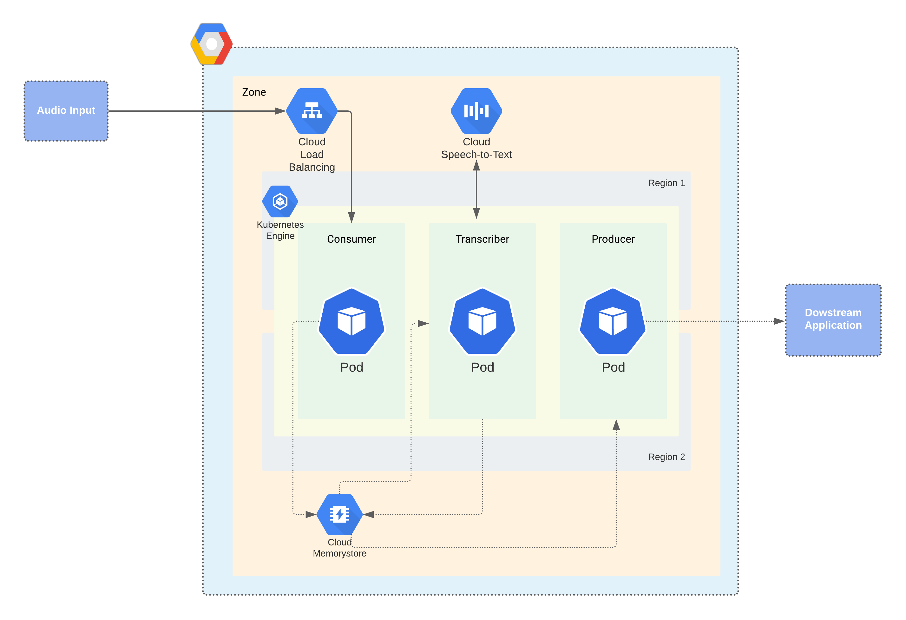

# Project : Live audio transcription

The vision of the project is to build a backend application which can stream audio and output a stream of transcribed text to server application. This project idea is inspired from the running transcription that Zoom provides while we watch the in-class lecture sessions

## Description

The application will be deployed on Google Kubernetes Engine cluster over multiple zones within a region. The application components consist of a Kubernetes cluster containing 3 nodes each servicing a microservice. These microservices being:
Consumer: Service takes audio input
Transcriber: Service calls Google Speech-to-Text and outputs the transcribed audio.
Producer: Service displays transactions in a web app. 

The work flow is as follows: The audio client streams audio to the Consumer using SocketIO library (package that provides real-time bidirectional communication).  This audio information is now stored in a redis database. The transcriber now takes this information from the corresponding database and calls the Speech-to-Text Engine which returns the transcribing results. This is again stored in the database. The Producer microservice displays the results through a display application. Load Balancers are attached to the Consumer to balance the load across multiple regions.

## Architecture diagram

